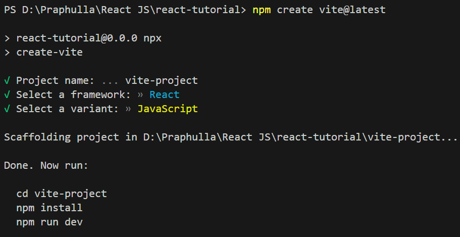
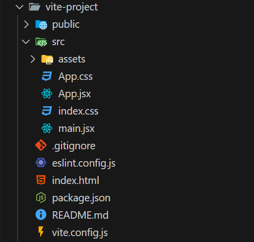

# *React JS Notes*

### *Install npm dependecies*

- *Install node lts*
- ```npm create vite@latest```
- 
- ```cd project-name```
- ```npm install```
- ```npm run dev```

### *Project File Overview*



### *Create New Components*

```jsx
import React from 'react'

const Practice = () => {
  return (
    <div>
      New Components
    </div>
  )
}

export default Practice

```

### *Component Props*

#### *App.jsx*

```jsx
import React from 'react'
import User from './components/User'
const App = () => {
    return (
        <div>
      <User name="Praphulla" age={18}/>
    </div>
  )
}

export default App
```

#### *User.jsx*

```jsx
import React from 'react'

const User = (props) => {
  return (
    <div>
      Username: {props.name}
      Age: {props.age}
    </div>
  )
}

export default User

```

### *Type Checking Props*

### *App.jsx*

```jsx
import React from "react";
import UserProfile from "./components/UserProfile";
import UserName from "./components/UserName";
const App = () => {
  const greet = () => {
    console.log("Hello, World");
  };
  return (
    <div>
      <h1>Hello, World</h1>
      <UserName
        name="Praphulla"
        age={18}
        email="praphullamall62@gmail.com"
        Greet={greet}
      />
      <UserProfile
        FavoriteFoods={[
          {
            name: "Pizza",
            price: 650,
          },
          {
            name: "Cheese Balls",
            price: 450,
          },
          {
            name: "Grilled Chicken",
            price: 490,
          },
        ]}
      />
    </div>
  );
};

export default App;

```
### *UserName.jsx*

```jsx
import React from "react";
import PropTypes from "prop-types";

const UserName = (props) => {
  props.Greet();
  return (
    <div>
      <p>Username: {props.name}</p>
      <div>
        <span>Age: </span>
        <span>{props.age}</span>
        <br />
        <span>Email: </span>
        <span>{props.email}</span>
      </div>
    </div>
  );
};

export default UserName;

UserName.propTypes = {
  name: PropTypes.string.isRequired,
  age: PropTypes.number.isRequired,
  email: PropTypes.string.isRequired,
  Greet: PropTypes.func.isRequired
};

```
### *UserProfile.jsx*

```jsx
import React from "react";
import PropTypes from "prop-types"
const UserProfile = (props) => {
  return (
    <div>
      <section>
        <span>Favorite Foods:</span>
        <ul>
          <li>{props.FavoriteFoods[0].name}</li>
          Rs {props.FavoriteFoods[0].price}
          <li>{props.FavoriteFoods[1].name}</li>
          Rs {props.FavoriteFoods[1].price}
          <li>{props.FavoriteFoods[2].name}</li>
          Rs {props.FavoriteFoods[2].price}
        </ul>
      </section>
    </div>
  );
};

export default UserProfile;


UserProfile.propTypes = {
  FavoriteFoods: PropTypes.arrayOf(
    PropTypes.shape({
      name: PropTypes.string.isRequired,
      price: PropTypes.number.isRequired,
    })
  )
}
```

### *Children Components*

- *UserName and UserProfile components are children component of App (parent) component*
- *UserName and UserProfile components are sibiling components*

### *Fragments*

- *A React Fragment lets you return multiple elements from a component without adding extra nodes to the DOM.*

```jsx
import React from 'react'

const User = (props) => {
  return (
    <React.Fragment>
      Username: {props.name}
      Age: {props.age}
    </React.Fragment>
  )
}

export default User

```
#### *OR*
```jsx
import React from 'react'

const User = (props) => {
  return (
    <>
      Username: {props.name}
      Age: {props.age}
    </>
  )
}

export default User

```

### *Styling using tailwind css*

```powershell
npm install -D tailwindcss postcss autoprefixer
npx tailwindcss init -p
```

#### *tailwind.config.js*

```js
/** @type {import('tailwindcss').Config} */
export default {
  content: [
    "./index.html",
    "./src/**/*.{js,ts,jsx,tsx}",
  ],
  theme: {
    extend: {},
  },
  plugins: [],
}
```

#### *index.css*

```css
@tailwind base;
@tailwind components;
@tailwind utilities;
```

### *Rendering Dynamic Arrays*


#### *App.jsx*
```jsx
import React from "react";

const App = () => {
  const mockUsers = [
    {
      id: 1,
      username: "Praphulla",
      email: "Praphulla1@gmail.com"
    },
    {
      id: 2,
      username: "Michael",
      email: "Michael2@gmail.com"
    },
    {
      id: 3,
      username: "John",
      email: "John3@gmail.com"
    },
  ];

  return (
    <div>
      {mockUsers.map((user) => {
        return (
          <div className="border-orange-400 m-2 p-2 border-2" key={user.id}>
            <b>User ID: </b> <span>{user.id}</span>
            <br />
            <b>Username: </b> <span>{user.username}</span>
            <br />
            <b>User Email: </b> <span>{user.email}</span>
          </div>
        );
      })}
    </div>
  );
};

export default App;
```
### *Proper Way*

#### *App.jsx*

```jsx
import React from "react";
import UserDetail from "./components/UserDetail";

const App = () => {
  const mockUsers = [
    {
      id: 1,
      username: "Praphulla",
      email: "Praphulla1@gmail.com",
    },
    {
      id: 2,
      username: "Michael",
      email: "Michael2@gmail.com",
    },
    {
      id: 3,
      username: "John",
      email: "John3@gmail.com",
    },
  ];

  return (
    <div>
      {mockUsers.map((user) => {
        return (
          <UserDetail user={user} />
        );
      })}
    </div>
  );
};

export default App;


```

#### *UserDetail.jsx*

```jsx
import React from "react";

const UserDetail = (props) => {
  return (
    <div className="border-orange-400 m-2 p-2 border-2" key={props.user.id}>
      <b>User ID: </b> <span>{props.user.id}</span>
      <br />
      <b>Username: </b> <span>{props.user.username}</span>
      <br />
      <b>User Email: </b> <span>{props.user.userEmail}</span>
    </div>
  );
};

export default UserDetail;


```

### *OR (Destructure)*

```jsx
import React from "react";

const UserDetail = ({user}) => {
  return (
    <div className="border-orange-400 m-2 p-2 border-2" key={user.id}>
      <b>User ID: </b> <span>{user.id}</span>
      <br />
      <b>Username: </b> <span>{user.username}</span>
      <br />
      <b>User Email: </b> <span>{user.userEmail}</span>
    </div>
  );
};

export default UserDetail;

```

### *Conditional Renderinig*

```jsx
import React, { useState } from "react";

const App = () => {
  const [loggedIn, setLoggedIn] = useState(false);
  return (
    <div>
      {loggedIn ? (
        <div>
          <span>Logged In</span>
          <h1>Welcome User</h1>
        </div>
      ) : (
        <div>
          <span>Not Logged In</span>
          <h1>Please Log In</h1>
        </div>
      )}
    </div>
  );
};

export default App;

```